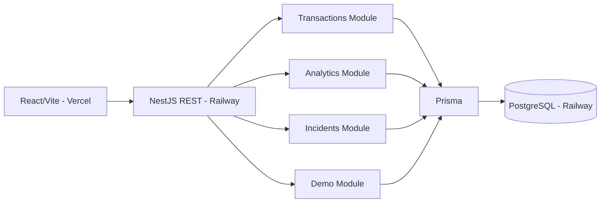

# Integración del backend anterior -> NextWave Hackathon

## Decisión principal

Se conserva el proyecto **NextWaveHackaton-back-main** como base. No se migra TypeORM ni la estructura completa del reto anterior.

Motivos:
- El proyecto nuevo ya tiene Prisma + PostgreSQL, Railway y CORS para Vercel.
- El modelo nuevo usa dimensiones como strings, suficiente para un MVP y más rápido de cambiar durante el reto.
- El backend anterior mezcla lógica de dominio, persistencia y notificaciones en servicios de 500-900 líneas; copiarlo completo aumenta el costo de debug.

## Qué se reutilizó

| Backend anterior | Integración nueva | Motivo |
|---|---|---|
| `transaction/*` | `modules/transactions/*` | Ingesta, filtros y acceso a transacciones siguen siendo núcleo del dominio. |
| `failure-prediction/*` | `modules/analytics/*` | Se conserva el enfoque de señales + baseline + score de riesgo, reescrito para Prisma. |
| `alert/*` + `risk-notification/*` | `modules/incidents/*` | Se reduce a una entidad `Incident` con ciclo OPEN/ACKNOWLEDGED/RESOLVED. |
| `seed/*` | `modules/demo/*` | Seed determinista y pequeño, diseñado para tener una anomalía demostrable desde el inicio. |
| `health-graph/*` | Resultado de `/analytics/risk?groupBy=route` | La información de salud de ruta se conserva sin duplicar un servicio de 700 líneas. |

## Qué NO se integró todavía

- `merchant`, `provider`, `payment-method`, `country` como tablas CRUD: en el MVP son dimensiones de `Transaction`.
- `user` y `on-call`: no son necesarios hasta que el challenge exija ownership/escalamiento.
- Gmail/Twilio/Slack: el patrón Strategy/Factory es reutilizable, pero añadir dependencias y credenciales antes de conocer el reto es YAGNI.
- Cron jobs: ejecutar detección on-demand es más fácil de demostrar y debuggear; se puede añadir `@nestjs/schedule` después si el reto lo exige.

## Mejora sobre el predictor viejo

El predictor anterior consultaba el baseline desde `now - baselineHours` hasta `now`, por lo que la ventana reciente también quedaba incluida en el baseline. La nueva versión separa:

`[baselineStart ---- currentStart) [currentStart ---- now]`

Así una degradación reciente no contamina su propia referencia histórica.

También se usa `approvalDrop = baselineApproval - currentApproval` como señal explícita, más útil en orquestación de pagos que un umbral absoluto de approval muy bajo.

## Flujo de demo

1. `POST /api/demo/seed?reset=true`
2. `GET /api/analytics/risk?groupBy=route&timeWindowMinutes=60&baselineHours=24&minSampleSize=10`
3. `POST /api/analytics/detect` con:

```json
{
  "groupBy": "route",
  "timeWindowMinutes": 60,
  "baselineHours": 24,
  "minSampleSize": 10
}
```

4. `GET /api/incidents?status=OPEN`
5. `PATCH /api/incidents/:id/acknowledge`
6. `PATCH /api/incidents/:id/resolve`

El seed crea una degradación deliberada en:
`Nova Travel / dLocal / CARD / CO / Bancolombia`.

## Arquitectura resultante



Es un **modular monolith**: suficiente aislamiento por feature sin el overhead de microservicios durante 24h.

## 2026-08-29 - Sync deployment fix from `NextWaveHackaton-back-main`

Applied the deployment/Nest/Prisma fixes present in the latest normal backend without removing the integrated hackathon modules:

- Moved `@nestjs/cli`, `@nestjs/schematics`, `typescript`, `@types/node`, and `@types/express` from `devDependencies` to `dependencies` so production installs that omit dev dependencies can still run the Nest build/postinstall flow.
- Synchronized `package-lock.json` with that dependency layout.
- Updated `prisma.config.ts` to provide `datasource.url` from `DATABASE_URL` (Prisma 7 configuration style).
- Removed `url = env("DATABASE_URL")` from `prisma/schema.prisma`, while preserving the integrated `TIMEOUT`, latency/error fields, incident statuses, and indexes.
- Updated `tsconfig.json` to use only `node` global types for the production build; Vitest continues to provide globals through its own config.
- Preserved `TransactionsModule`, `AnalyticsModule`, `IncidentsModule`, and `DemoModule` imports in `AppModule`.
